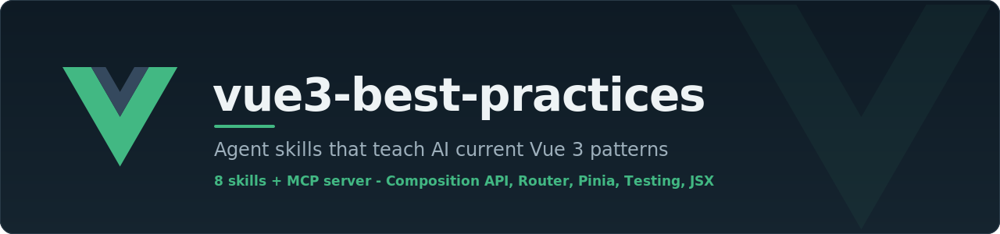

<p align="center">
  
</p>

<p align="center">
  <a href="https://github.com/Pythoughts-labs/vue3-best-practices/actions/workflows/ci.yml"></a>
  <a href="LICENSE"></a>
  
  
  
  
  <a href="#contributing"></a>
</p>

<p align="center">
  Agent skills that teach AI coding agents current Vue 3 patterns, validated with automated evals.<br>
  Maintained by <a href="https://github.com/Pythoughts-labs">Pythoughts-labs</a>.
</p>

<p align="center">
  <a href="#install">Install</a> -
  <a href="#mcp-server">MCP server</a> -
  <a href="#skills">Skills</a> -
  <a href="#how-it-works">How it works</a> -
  <a href="#contributing">Contributing</a>
</p>

---

## Install

Add the skills to any agent that supports the `skills` registry:

```bash
npx skills add Pythoughts-labs/vue3-best-practices
```

### Claude Code marketplace

```bash
# Add the marketplace
/plugin marketplace add Pythoughts-labs/vue3-best-practices

# Install everything at once
/plugin install vue-skills-bundle@vue3-best-practices

# Or install individual skills
/plugin install vue-best-practices@vue3-best-practices
/plugin install vue-best-practices@vue3-best-practices vue-router-best-practices@vue3-best-practices
```

### Trigger reliably

Prefix a prompt with `use vue skill` so the agent loads the patterns before coding:

```
Use vue skill, build a todo list with filtering
```

Without the prefix, triggering depends on how closely the prompt matches a skill's description keywords.

## MCP server

For agents that consume MCP instead of the skills registry, [`mcp/`](mcp/) exposes every skill as MCP tools. The agent calls `vue_best_practices` when it detects Vue work, then pulls individual reference files on demand.

```bash
cd mcp && npm install
```

Then register the server. Replace `<REPO>` with the absolute path to this clone.

### Claude Code

```bash
claude mcp add vue-skills -- node <REPO>/mcp/index.mjs
```

### Cursor

`~/.cursor/mcp.json`:

```json
{
  "mcpServers": {
    "vue-skills": {
      "command": "node",
      "args": ["<REPO>/mcp/index.mjs"]
    }
  }
}
```

### Windsurf

`~/.codeium/windsurf/mcp_config.json`:

```json
{
  "mcpServers": {
    "vue-skills": {
      "command": "node",
      "args": ["<REPO>/mcp/index.mjs"]
    }
  }
}
```

### Any MCP client (generic stdio)

```json
{
  "mcpServers": {
    "vue-skills": {
      "command": "node",
      "args": ["<REPO>/mcp/index.mjs"],
      "env": { "VUE_SKILLS_DIR": "<REPO>/skills" }
    }
  }
}
```

`VUE_SKILLS_DIR` is optional and defaults to `../skills` relative to the server. Full details and the two tools (`vue_best_practices`, `get_vue_reference`) are documented in [mcp/README.md](mcp/README.md).

> MCP has no push trigger, so an agent calls a tool only when it judges the description relevant. To guarantee the skill loads on every Vue task, add one line to your agent rules (`AGENTS.md`, `.cursorrules`, or `CLAUDE.md`): "Before any Vue work, call the `vue_best_practices` MCP tool and apply it."

## Skills

| Skill | When to use | Covers |
|-------|-------------|--------|
| **vue-best-practices** | Vue 3 + Composition API + TypeScript | Reactivity, SFC structure, data flow, composables, SSR, performance |
| **vue-options-api-best-practices** | Options API (`data()`, `methods`) | `this` context, lifecycle, TypeScript with Options API |
| **vue-router-best-practices** | Vue Router 4 | Navigation guards, route params, route-component lifecycle |
| **vue-pinia-best-practices** | Pinia state management | Store setup, reactivity, `storeToRefs`, state patterns |
| **vue-testing-best-practices** | Component or E2E tests | Vitest, Vue Test Utils, Playwright |
| **vue-jsx-best-practices** | JSX in Vue | Syntax differences from React JSX, plugin config |
| **vue-debug-guides** | Debugging Vue 3 | Runtime errors, warnings, async failures, hydration issues |
| **vue-ai-apps** | AI/LLM & agent apps in Vue/Nuxt | Streaming chat UIs, Vercel AI SDK, `useChat`, tool calling, structured output |

## How it works

### Skill types

- **Capability:** the agent cannot solve the problem without the skill. These cover version-specific behavior, recent features, and cases outside the model's training data.
- **Efficiency:** the agent can solve the problem but not well. These supply the optimal pattern and a consistent approach.

### Validation

Each rule is validated with automated evals: a baseline run without the skill, and a run with it installed.

| Baseline | With skill | Action |
|----------|-----------|--------|
| Fail | Pass | Keep |
| Pass | Pass | Consider removing |

A rule is kept only when it lets the model solve something it could not solve on its own.

## Contributing

Development happens on `dev`. The `main` branch holds published skills only.

1. Create a feature branch from `dev`
2. Open a PR to `dev`
3. After review, changes merge to `dev`
4. Maintainers sync `dev` to `main` via the GitHub Action when ready to publish

## License

MIT, see [LICENSE](LICENSE).
